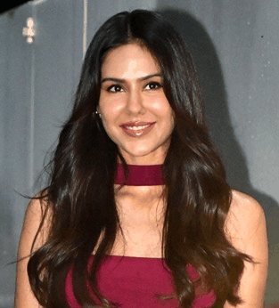
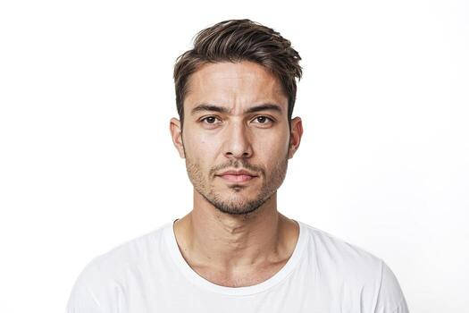
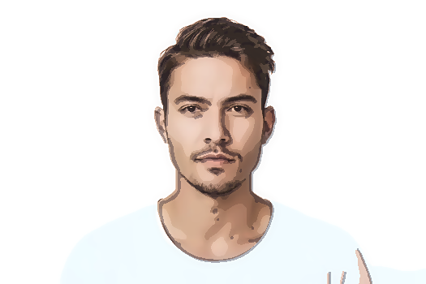
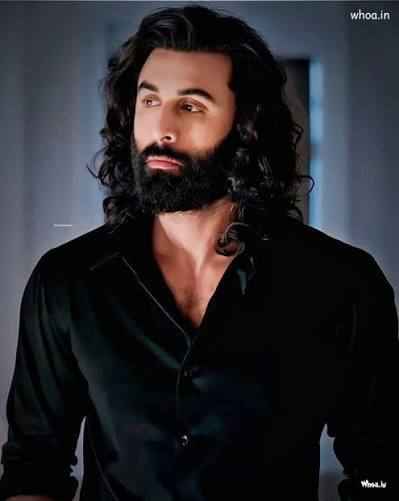
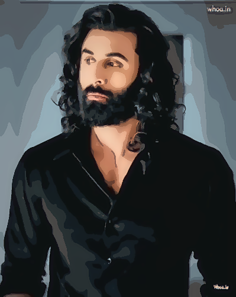
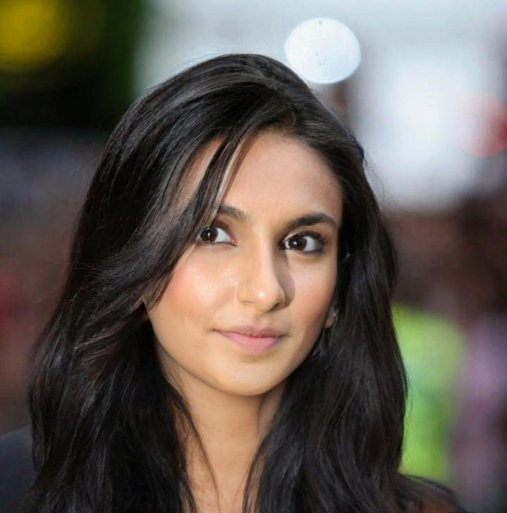
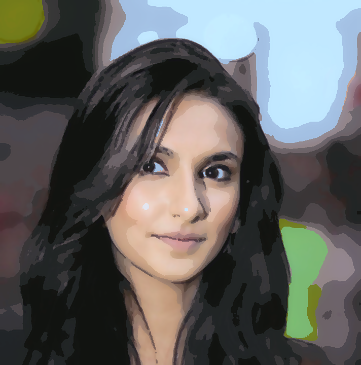
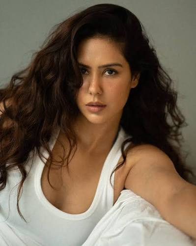
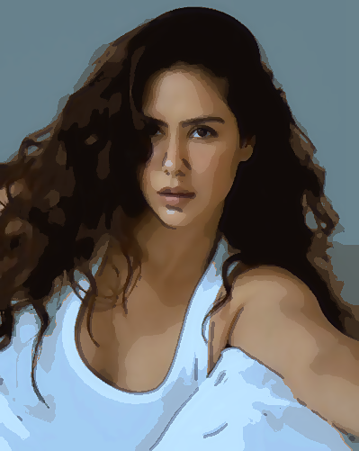
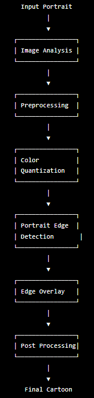

# 🎨 Portrait Cartoonifier

Transform portrait photographs into artistic cartoon-style images using **Computer Vision**, **OpenCV**, and **Image Processing** techniques.

<p align="center">
  
</p>

---

## 🌟 Features

- 📸 Upload any portrait image.
- 🎨 Generate high-quality cartoon portraits.
- 🧑‍🎨 Portrait-specific processing pipeline.
- 🖼️ Interactive Before/After comparison.
- 🔍 View intermediate processing stages.
- 📥 Download the final cartoon image.
- 🌐 Streamlit Web Application.
- ⚡ Fast and lightweight implementation using OpenCV.

---

# 🖼️ Example Results

## Example 1

| Original | Cartoon |
|----------|----------|
|  |  |

---
## Example 2

| Original | Cartoon |
|----------|----------|
|  |  |

## Example 3

| Original | Cartoon |
|----------|----------|
|  |  |

---

## Example 4

| Original | Cartoon |
|----------|----------|
|  |  |

# 🏗️ Project Architecture

<p align="center">
  
</p>

---

# 📂 Project Structure

```text
Portrait_Cartoonifier/
│
├── assets/
│   ├── architecture.png
│   └── demo.gif
│
├── examples/
│   ├── inputs/
│   └── outputs/
│
├── src/
│   ├── __init__.py
│   ├── image_analysis.py
│   ├── preprocessing.py
│   ├── color_quantization.py
│   ├── edge_detection.py
│   ├── cartoonizer.py
│   ├── postprocess.py
│   ├── pipeline.py
│   └── utils.py
│
├── app.py
├── main.py
├── config.py
├── requirements.txt
├── README.md
└── .gitignore
```

---

# 🚀 Demo

### Streamlit Application

```bash
streamlit run app.py
```

---

# ⚙️ Installation

## 1. Clone Repository

```bash
git clone https://github.com/ATULESH-36/Portrait_Cartoonifier.git
cd Portrait_Cartoonifier
```

---

## 2. Create Virtual Environment

### Windows

```bash
python -m venv .venv
.venv\Scripts\activate
```

### Linux/Mac

```bash
python3 -m venv .venv
source .venv/bin/activate
```

---

## 3. Install Dependencies

```bash
pip install -r requirements.txt
```

---

# ▶️ Running the Application

## Streamlit UI

```bash
streamlit run app.py
```

---

## Python Script

```python
import cv2
from src.pipeline import PortraitPipeline

image = cv2.imread("portrait.jpg")

pipeline = PortraitPipeline()
result = pipeline.cartoonify(image)

cv2.imwrite(
    "cartoon.png",
    result["final"]
)
```

---

# 🔬 Processing Pipeline

The project follows a multi-stage portrait cartoonification pipeline.

```text
Input Image
      │
      ▼
Image Analysis
      │
      ▼
Preprocessing
      │
      ▼
Color Quantization
      │
      ▼
Portrait Edge Detection
      │
      ▼
Edge Overlay
      │
      ▼
Post Processing
      │
      ▼
Final Cartoon
```

---

# 🧠 Techniques Used

## Image Analysis
- Brightness estimation
- Contrast estimation
- Entropy computation
- Noise estimation
- Edge density computation

## Preprocessing
- White balancing
- Gamma correction
- CLAHE enhancement
- Denoising
- Bilateral smoothing

## Color Quantization
- K-Means clustering
- Mean Shift filtering
- Adaptive color palette selection
- Detail reinjection
- Skin preservation

## Edge Detection
- Adaptive thresholding
- Morphological operations
- Connected component filtering
- Portrait-specific edge refinement

## Post Processing
- Saturation enhancement
- Contrast adjustment
- Bilateral smoothing
- Skin tone enhancement
- Unsharp masking

---

# 💻 Tech Stack

| Category | Technologies |
|----------|---------------|
| Language | Python |
| Computer Vision | OpenCV |
| Numerical Computing | NumPy |
| UI | Streamlit |
| Image Handling | Pillow |

---

# 📊 Intermediate Outputs

The application allows visualization of:

- Preprocessed Image
- Quantized Image
- Edge Map
- Cartoon Before Postprocessing
- Final Cartoon

---

# 🎯 Challenges Solved

- Handling portraits under varying lighting conditions.
- Preserving skin tones during quantization.
- Removing noisy edge artifacts.
- Generating smooth cartoon shading.
- Designing portrait-specific edge extraction.
- Maintaining facial details while reducing colors.

---

# 📈 Future Improvements

- Real-time webcam cartoonification.
- Multiple artistic styles.
- Face-aware adaptive quantization.
- Batch image processing.
- Mobile deployment.
- REST API support.
- Deep-learning-based style transfer.

---

# 📝 Requirements

```text
numpy
opencv-python
streamlit
Pillow
streamlit-image-comparison
```

---

# 👨‍💻 Author

**Atulesh Sahoo**

B.Tech Computer Science Engineering  
Indian Institute of Information Technology Dharwad

---

# ⭐ If you found this project useful

Please consider giving the repository a star.

```bash
⭐ Star this repository
🍴 Fork this repository
```

---

# 📜 License

This project is released under the MIT License.